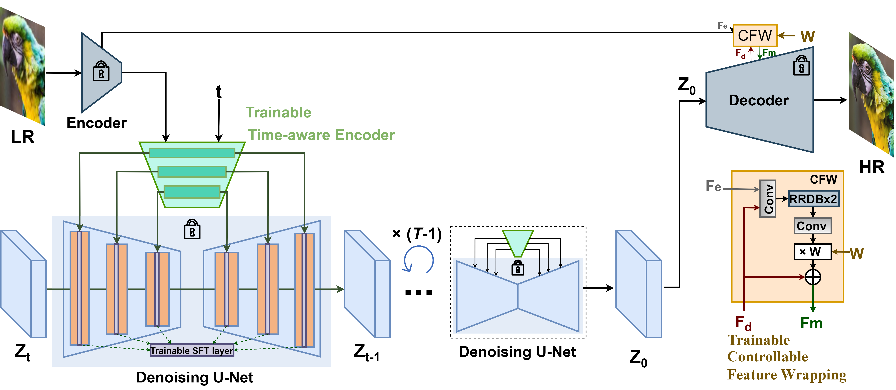

  

## Exploiting Diffusion Prior for Real-World Image Super-Resolution

[Paper](https://arxiv.org/abs/2305.07015) | [Project Page](https://iceclear.github.io/projects/stablesr/) | [Video](https://www.youtube.com/watch?v=5MZy9Uhpkw4) | [WebUI](https://github.com/pkuliyi2015/sd-webui-stablesr) | [ModelScope](https://modelscope.cn/models/xhlin129/cv_stablesr_image-super-resolution/summary) | [ComfyUI](https://github.com/gameltb/comfyui-stablesr)

    

[Jianyi Wang](https://iceclear.github.io/), [Zongsheng Yue](https://zsyoaoa.github.io/), [Shangchen Zhou](https://shangchenzhou.com/), [Kelvin C.K. Chan](https://ckkelvinchan.github.io/), [Chen Change Loy](https://www.mmlab-ntu.com/person/ccloy/)

S-Lab, Nanyang Technological University

### Details
- **2024.06.28**: Accepted by [IJCV](https://link.springer.com/journal/11263). See the latest [Full paper](https://github.com/IceClear/StableSR/releases/download/UncompressedPDF/StableSR_IJCV_Uncompressed.pdf).
Detailed documentation of my own important process of learning to generate models. Includes historically reproduced code sets and innovations in my work.

Code files for adding comments and some thinking about understanding in the StableSR model:
