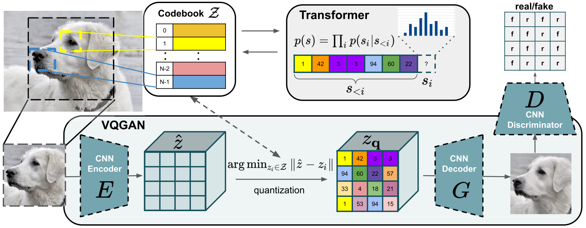

# Taming Transformers for High-Resolution Image Synthesis
##### CVPR 2021 (Oral)

[**Taming Transformers for High-Resolution Image Synthesis**](https://compvis.github.io/taming-transformers/)<br/>
[Patrick Esser](https://github.com/pesser)\*,
[Robin Rombach](https://github.com/rromb)\*,
[Björn Ommer](https://hci.iwr.uni-heidelberg.de/Staff/bommer)<br/>
\* equal contribution

**tl;dr** We combine the efficiancy of convolutional approaches with the expressivity of transformers by introducing a convolutional VQGAN, which learns a codebook of context-rich visual parts, whose composition is modeled with an autoregressive transformer.


[arXiv](https://arxiv.org/abs/2012.09841) | [BibTeX](#bibtex) | [Project Page](https://compvis.github.io/taming-transformers/)


## BibTeX

```
@misc{esser2020taming,
      title={Taming Transformers for High-Resolution Image Synthesis}, 
      author={Patrick Esser and Robin Rombach and Björn Ommer},
      year={2020},
      eprint={2012.09841},
      archivePrefix={arXiv},
      primaryClass={cs.CV}
}
```
